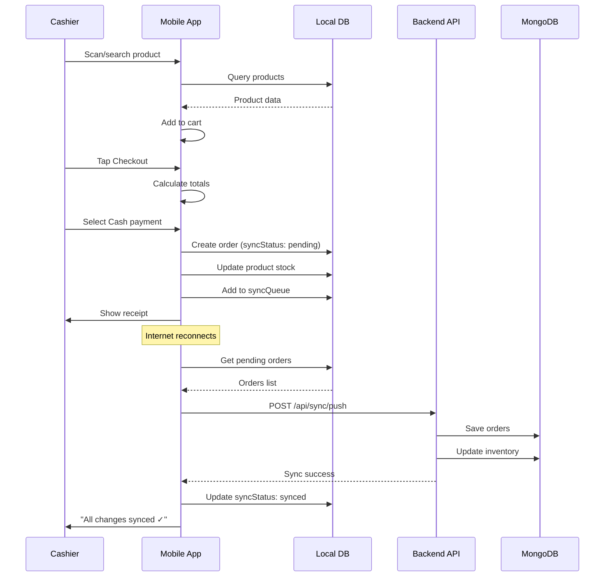
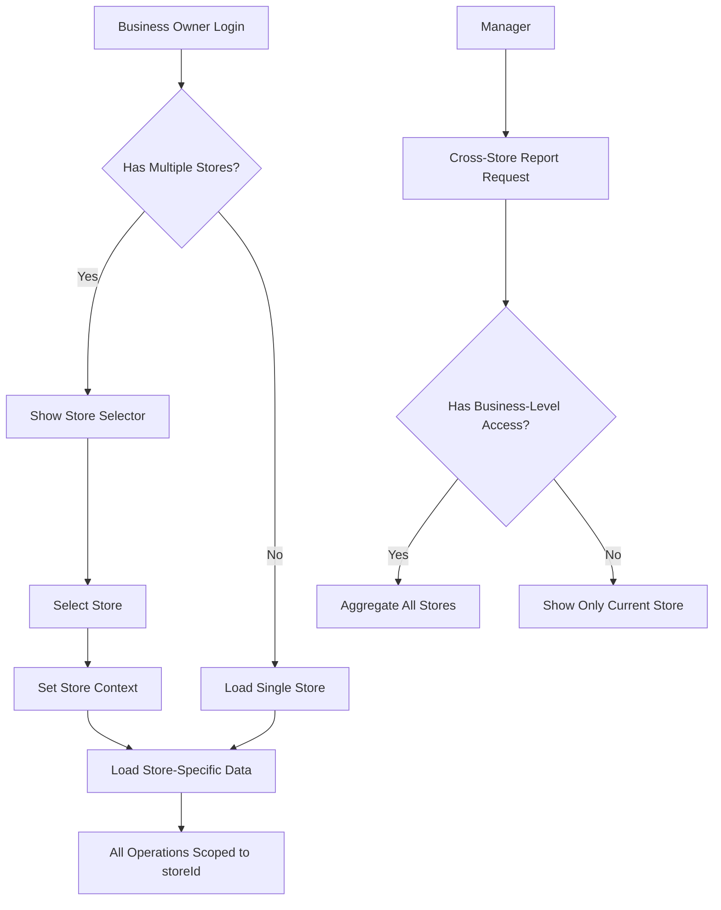

<!-- 5ffb5636-52c6-4e1e-85fb-2885a4f09738 bf3fe827-273f-4635-ad64-012f360bdab0 -->
# HandeePOS Phase-Based Implementation Roadmap

## Phase 1: MVP (Minimum Viable Product) - 8-10 weeks

### Goals

Build core POS functionality enabling cashiers to process sales offline with basic product management, authentication, and data synchronization.

### Success Criteria

- Cashier can login, add products to cart, complete cash sales, and generate receipts
- All transactions work offline and sync when connectivity restores
- Products can be added/edited with basic inventory tracking
- End-of-day sales summary report available
- 95%+ offline reliability, <30s sync time for typical queue

### Core Modules

#### Week 1-2: Foundation & Authentication

**Backend:**

- MongoDB connection setup with Mongoose
- User model with role-based permissions
- Store model with basic configuration
- JWT authentication endpoints (login, logout, refresh token)
- Auth middleware for protected routes
- Rate limiting middleware

**Mobile:**

- Project structure with Expo Router
- Authentication screens (login)
- SecureStore integration for tokens
- Auth context/state management (Zustand)
- API client with token refresh logic
- Environment configuration

**API Endpoints:**

```
POST   /api/auth/login
POST   /api/auth/logout
POST   /api/auth/refresh-token
GET    /api/auth/me
```

**MongoDB Collections:**

```javascript
Users: { _id, email, passwordHash, fullName, role, storeId, permissions, isActive, createdAt, updatedAt }
Stores: { _id, name, address, currency, timezone, receiptSettings, isActive, createdAt }
```

**Testing Focus:**

- Unit: JWT generation/validation, password hashing
- Integration: Login flow, token refresh, rate limiting
- Security: Failed login attempts, invalid tokens

**Developer Checklist:**

- [ ] Set up MongoDB Atlas or local instance
- [ ] Create User and Store Mongoose models with validation
- [ ] Implement bcrypt password hashing (cost factor 12)
- [ ] Build JWT service (sign, verify, refresh)
- [ ] Create auth controller (login, logout, refresh, me)
- [ ] Add auth middleware checking JWT and permissions
- [ ] Set up rate limiter (5 login attempts per 15 min)
- [ ] Build login screen with form validation
- [ ] Implement SecureStore for token storage
- [ ] Create Zustand auth store with login/logout actions
- [ ] Build axios client with interceptors for auth
- [ ] Add auto token refresh on 401 responses
- [ ] Write integration tests for auth flow
- [ ] Test offline token validation

#### Week 3-4: Products & Inventory

**Backend:**

- Product model with categories, pricing, stock
- Category model
- Product CRUD endpoints
- Search/filter by name, SKU, barcode
- Low stock threshold alerts
- Stock adjustment logging

**Mobile:**

- WatermelonDB setup and schema
- Product list screen with search/filter
- Add/edit product form
- Barcode scanner integration (Expo Barcode Scanner)
- Offline product storage
- Basic sync service for products

**API Endpoints:**

```
GET    /api/products?search=&category=&page=&limit=
GET    /api/products/low-stock
GET    /api/products/search?barcode=123456
POST   /api/products
PUT    /api/products/:id
DELETE /api/products/:id
GET    /api/categories
POST   /api/categories
```

**MongoDB Collections:**

```javascript
Products: { _id, storeId, name, sku, barcode, categoryId, price, cost, taxRate, stockQuantity, lowStockThreshold, unit, images, isActive, syncVersion, createdAt, updatedAt }
Categories: { _id, storeId, name, description, isActive, createdAt }
```

**WatermelonDB Schema:**

```javascript
products: { id, name, sku, barcode, categoryId, price, cost, taxRate, stockQuantity, lowStockThreshold, syncStatus, lastSyncedAt }
categories: { id, name, description }
```

**Testing Focus:**

- Unit: Product validation, stock calculations
- Integration: CRUD operations, search/filter
- E2E: Add product → search → edit → verify offline

**Developer Checklist:**

- [ ] Create Product and Category Mongoose models
- [ ] Build product controller with CRUD + search
- [ ] Add pagination helper (50 items per page)
- [ ] Implement barcode/SKU unique validation
- [ ] Create category management endpoints
- [ ] Set up WatermelonDB with products/categories tables
- [ ] Build product list screen with infinite scroll
- [ ] Create add/edit product form with validation
- [ ] Integrate Expo Barcode Scanner for barcode input
- [ ] Implement local product search (fuzzy matching)
- [ ] Build sync service pulling products from API
- [ ] Handle conflicts (server wins for products)
- [ ] Add low stock indicator UI
- [ ] Write tests for offline product creation/editing

#### Week 5-6: Sales Flow & Orders

**Backend:**

- Order model with items, payments, status
- Order creation endpoint with inventory decrement
- Order listing with filters (date, status, cashier)
- Order statistics endpoint
- Atomic stock updates with transactions

**Mobile:**

- Sales screen with product search and cart
- Cart management (add, remove, quantity adjust)
- Checkout flow (cash payment)
- Receipt generation (in-app display)
- Offline order queueing
- Order sync with retry logic

**API Endpoints:**

```
POST   /api/orders
GET    /api/orders?startDate=&endDate=&status=&page=
GET    /api/orders/:id
GET    /api/orders/stats?date=today
```

**MongoDB Collections:**

```javascript
Orders: { _id, orderNumber, storeId, cashierId, customerId, items: [{ productId, productName, sku, quantity, unitPrice, discount, tax, subtotal }], subtotal, taxAmount, discountAmount, total, payments: [{ method, amount, reference }], status, customNote, createdAt, completedAt, syncStatus, deviceId }
```

**WatermelonDB Schema:**

```javascript
orders: { id, orderNumber, cashierId, items (JSON), subtotal, taxAmount, discountAmount, total, payments (JSON), status, syncStatus, createdAt, completedAt }
syncQueue: { id, operation, collection, documentId, data (JSON), timestamp, status, retryCount }
```

**Sales Flow Diagram:**



**Testing Focus:**

- Unit: Cart calculations, tax/discount logic
- Integration: Order creation, stock decrement atomicity
- E2E: Full sale flow offline → sync → verify server
- Load: 50 concurrent orders with inventory conflicts

**Developer Checklist:**

- [ ] Create Order Mongoose model with embedded items
- [ ] Build order controller with validation
- [ ] Implement atomic stock update (Mongoose transactions)
- [ ] Add order number generation (ORD-YYYYMMDD-NNN)
- [ ] Create order statistics aggregation pipeline
- [ ] Build sales screen with product search
- [ ] Implement cart state management
- [ ] Create cart item component with quantity controls
- [ ] Build checkout screen with payment method selector
- [ ] Implement receipt template generator
- [ ] Create local order creation with syncQueue entry
- [ ] Build sync service for pushing orders
- [ ] Add retry logic with exponential backoff
- [ ] Implement conflict resolution (server authority)
- [ ] Handle partial sync failures
- [ ] Write E2E test: offline sale → sync → verify backend
- [ ] Test inventory decrement race conditions

#### Week 7-8: Customers, Reports & Settings

**Backend:**

- Customer model with contact info, purchase history
- Customer search endpoint
- Basic sales reports (daily summary)
- Store settings endpoints

**Mobile:**

- Customer list and search
- Add customer to order
- Daily sales report screen
- Settings screen (store profile, receipt template)
- Sync status indicator

**API Endpoints:**

```
GET    /api/customers?search=&page=
GET    /api/customers/:id
POST   /api/customers
PUT    /api/customers/:id
GET    /api/customers/search?query=
GET    /api/reports/sales?startDate=&endDate=
GET    /api/stores/:id
PUT    /api/stores/:id
```

**MongoDB Collections:**

```javascript
Customers: { _id, storeId, name, email, phoneNumber, address, totalSpent, totalOrders, lastVisit, notes, createdAt, updatedAt }
```

**Testing Focus:**

- Unit: Report aggregations, customer stats
- Integration: Customer CRUD, report generation
- E2E: Add customer → attach to order → verify stats

**Developer Checklist:**

- [ ] Create Customer Mongoose model
- [ ] Build customer controller with search
- [ ] Implement sales report aggregation (daily summary)
- [ ] Create store settings update endpoint
- [ ] Build customer list screen with search
- [ ] Create add/edit customer form
- [ ] Add customer selector to checkout flow
- [ ] Update order to include customerId
- [ ] Build daily sales report screen
- [ ] Display: total sales, transaction count, payment breakdown
- [ ] Create settings screen for store profile
- [ ] Add receipt customization (header/footer text)
- [ ] Build sync status indicator (top bar)
- [ ] Show pending sync count and last sync time
- [ ] Add manual sync trigger button
- [ ] Write integration tests for reports
- [ ] Test multi-day report date ranges

#### Week 9-10: Testing, Polish & Deployment

**Activities:**

- Comprehensive E2E test suite (Maestro or Detox)
- Offline mode stress testing (airplane mode scenarios)
- Sync conflict resolution testing
- UI/UX refinements (loading states, error handling)
- Performance optimization (lazy loading, pagination)
- Backend deployment setup (Docker, Railway/DigitalOcean)
- MongoDB indexes for performance
- API documentation (Swagger)
- User documentation (getting started guide)

**Deployment Checklist:**

- [ ] Set up production MongoDB Atlas cluster
- [ ] Configure environment variables (secrets)
- [ ] Add database indexes (storeId, barcode, orderNumber, syncStatus)
- [ ] Set up backend hosting (Docker + Railway/Heroku)
- [ ] Configure HTTPS with SSL certificate
- [ ] Set up error tracking (Sentry)
- [ ] Configure logging (Winston to file/service)
- [ ] Build mobile app for TestFlight/internal testing
- [ ] Create Expo EAS build configuration
- [ ] Write deployment documentation
- [ ] Perform load testing (100 req/min)
- [ ] Test database backup/restore procedure
- [ ] Create monitoring dashboard (uptime, errors)

**Key Risks & Mitigation:**

| Risk | Impact | Mitigation |

|------|--------|------------|

| Sync conflicts causing data loss | High | Comprehensive conflict resolution tests, server-authoritative orders |

| Offline mode database size growth | Medium | Implement data pruning (archive old orders locally) |

| Barcode scanner camera permissions | Medium | Fallback manual SKU entry, clear permission request UX |

| Receipt printer compatibility | Medium | Test with common ESC/POS printers, provide fallback email/SMS |

| MongoDB connection failures | High | Connection retry logic, circuit breaker pattern, local queue fallback |

---

## Phase 2: Enhanced Features - 6-8 weeks

### Goals

Expand payment methods, enhance inventory management, add loyalty programs, and enable hardware integration for professional POS setups.

### Success Criteria

- Support card and mobile money payments with gateway integration
- Product variants (size, color) fully functional
- Loyalty points system operational
- Bluetooth receipt printer functional
- Detailed product performance reports available

### Feature Additions

#### Payment Integration (2 weeks)

**Backend:**

- Payment gateway integration (Stripe for cards)
- Mobile money webhooks (M-Pesa, Paystack)
- Split payment handling
- Payment transaction model

**Mobile:**

- Card payment flow (Stripe SDK)
- Mobile money payment (QR/USSD)
- Split payment UI
- Payment retry on failure

**API Endpoints:**

```
POST   /api/payments/card/intent
POST   /api/payments/mobile-money/initiate
POST   /api/payments/verify/:transactionId
POST   /api/webhooks/stripe
POST   /api/webhooks/paystack
```

**MongoDB Collections:**

```javascript
PaymentTransactions: { _id, orderId, method, amount, status, gatewayReference, gatewayResponse, createdAt, completedAt }
```

**Developer Checklist:**

- [ ] Create Stripe account and get API keys
- [ ] Implement Stripe Payment Intent creation
- [ ] Add webhook handler for payment confirmation
- [ ] Integrate Paystack for mobile money
- [ ] Create payment transaction model with status tracking
- [ ] Build card payment screen with Stripe SDK
- [ ] Implement mobile money QR/USSD flow
- [ ] Create split payment UI (multiple methods)
- [ ] Add payment retry logic for failures
- [ ] Update order status after payment confirmation
- [ ] Test webhook signature verification
- [ ] Handle payment timeouts and failures

#### Advanced Inventory (2 weeks)

**Backend:**

- Product variants (size, color, etc.)
- Inventory adjustment tracking
- Stock transfer between stores (prep for multi-store)
- Inventory valuation report
- Bulk import CSV parser

**Mobile:**

- Variant selector UI
- Stock adjustment form with reasons
- Inventory adjustment history
- CSV bulk import screen
- Inventory valuation report

**API Endpoints:**

```
POST   /api/products/:id/variants
PUT    /api/products/:id/variants/:variantId
POST   /api/inventory/adjust
GET    /api/inventory/adjustments?productId=&startDate=
GET    /api/inventory/valuation
POST   /api/products/bulk-import
```

**MongoDB Collections:**

```javascript
InventoryAdjustments: { _id, storeId, productId, previousQuantity, newQuantity, adjustmentQuantity, reason, notes, performedBy, createdAt }
```

**Developer Checklist:**

- [ ] Update Product model to support variants array
- [ ] Create inventory adjustment model
- [ ] Build adjustment tracking with audit trail
- [ ] Implement CSV parser for bulk product import
- [ ] Create inventory valuation aggregation
- [ ] Build variant selector component
- [ ] Create stock adjustment form UI
- [ ] Add adjustment reason dropdown (restock, damage, count, return)
- [ ] Build adjustment history screen
- [ ] Implement bulk import with validation
- [ ] Create inventory report with cost/retail value
- [ ] Test variant stock tracking independently

#### Customer Loyalty (2 weeks)

**Backend:**

- Loyalty points calculation rules
- Points accumulation/redemption endpoints
- Customer tier system
- Purchase history aggregation

**Mobile:**

- Loyalty points display in checkout
- Points redemption flow
- Customer purchase history
- Tier badge display

**API Endpoints:**

```
GET    /api/customers/:id/loyalty
POST   /api/customers/:id/loyalty/redeem
GET    /api/customers/:id/orders
PUT    /api/customers/:id/tier
```

**Developer Checklist:**

- [ ] Add loyaltyPoints and tier to Customer model
- [ ] Create points calculation service (1 point per $1)
- [ ] Build points redemption logic (points → discount)
- [ ] Implement tier system (Bronze, Silver, Gold)
- [ ] Create purchase history aggregation
- [ ] Display loyalty points on customer select
- [ ] Build points redemption UI in checkout
- [ ] Show points earned on receipt
- [ ] Create customer purchase history screen
- [ ] Add tier badge to customer profile
- [ ] Test points accumulation across orders
- [ ] Verify points redemption validation

#### Hardware Integration (2 weeks)

**Mobile:**

- Bluetooth printer discovery and pairing
- ESC/POS receipt formatting
- External barcode scanner support
- Cash drawer trigger command
- Printer connection management

**Libraries:**

```
react-native-esc-pos-printer
react-native-bluetooth-escpos-printer
```

**Developer Checklist:**

- [ ] Install ESC/POS printer library
- [ ] Build printer discovery service
- [ ] Create printer connection manager
- [ ] Implement receipt formatter (ESC/POS commands)
- [ ] Add receipt preview before print
- [ ] Support Bluetooth and network printers
- [ ] Integrate external barcode scanner (HID)
- [ ] Add cash drawer open command
- [ ] Build printer settings screen
- [ ] Handle printer connection errors gracefully
- [ ] Test with Star TSP654II and Epson TM-T82
- [ ] Create fallback email/SMS receipt

#### Enhanced Reporting (1 week)

**Backend:**

- Product performance aggregations
- Payment method breakdown
- Profit margin analysis
- Custom date range reports
- Report export (PDF/CSV)

**Mobile:**

- Product performance report screen
- Payment breakdown chart
- Profit margin report
- Date range picker for reports
- Export functionality

**API Endpoints:**

```
GET    /api/reports/products?startDate=&endDate=&sort=sales
GET    /api/reports/payments?startDate=&endDate=
GET    /api/reports/profit-margin?startDate=&endDate=
POST   /api/reports/export
```

**Developer Checklist:**

- [ ] Create product sales aggregation pipeline
- [ ] Build payment method breakdown aggregation
- [ ] Implement profit margin calculation
- [ ] Add PDF export library (pdfkit)
- [ ] Build product performance screen with chart
- [ ] Create payment breakdown pie chart
- [ ] Implement profit margin report table
- [ ] Add date range picker component
- [ ] Build export button (PDF/CSV)
- [ ] Email report functionality
- [ ] Test large date ranges performance
- [ ] Optimize aggregations with indexes

**Key Risks & Mitigation:**

| Risk | Impact | Mitigation |

|------|--------|------------|

| Payment gateway integration complexity | High | Use well-documented SDKs, thorough webhook testing |

| Bluetooth printer compatibility issues | Medium | Test with 3+ printer models, clear setup documentation |

| CSV import data validation | Medium | Comprehensive validation, preview before import |

| Loyalty points calculation errors | Medium | Extensive unit tests, audit trail for point changes |

---

## Phase 3: Advanced Features - 6-8 weeks

### Goals

Enable multi-store management, advanced discounting, staff tracking, and smart analytics features that differentiate HandeePOS from competitors.

### Success Criteria

- Business owners can manage multiple store locations
- Advanced discount rules (BOGO, bundles, time-based) functional
- Staff clock in/out and performance tracking operational
- Inventory predictions suggest reorder quantities
- QR code payments work end-to-end

### Feature Additions

#### Multi-Store Support (2 weeks)

**Backend:**

- Business account model
- Store hierarchy (business → stores)
- Store-specific inventory isolation
- Cross-store reporting aggregation
- Store transfer functionality

**Mobile:**

- Store selector on login (for multi-store users)
- Store context management
- Cross-store inventory view (managers only)
- Store transfer request flow

**API Endpoints:**

```
GET    /api/businesses/:id/stores
POST   /api/stores
PUT    /api/stores/:id
GET    /api/stores/:id/inventory
POST   /api/inventory/transfer
GET    /api/reports/multi-store?businessId=
```

**MongoDB Collections:**

```javascript
Businesses: { _id, name, ownerUserId, taxId, isActive, createdAt }
StoreTransfers: { _id, fromStoreId, toStoreId, productId, quantity, status, requestedBy, approvedBy, createdAt, completedAt }
```

**Multi-Store Data Flow:**



**Developer Checklist:**

- [ ] Create Business model with store references
- [ ] Update User model with business context
- [ ] Add store selector middleware
- [ ] Implement cross-store aggregation queries
- [ ] Create store transfer model and workflow
- [ ] Build store selector screen
- [ ] Add store context to Zustand store
- [ ] Filter all queries by current storeId
- [ ] Create cross-store inventory view
- [ ] Build store transfer request form
- [ ] Implement transfer approval workflow
- [ ] Add business-level reports
- [ ] Test data isolation between stores
- [ ] Verify permissions at store level

#### Advanced Discounts (1.5 weeks)

**Backend:**

- Discount rules engine
- BOGO (Buy X Get Y) logic
- Bundle pricing
- Time-based discounts (happy hour)
- Customer-specific pricing

**Mobile:**

- Discount rule selector in checkout
- BOGO indicator on products
- Bundle creation UI
- Time-based discount auto-apply
- Custom discount override (manager permission)

**API Endpoints:**

```
GET    /api/discounts?active=true&storeId=
POST   /api/discounts
PUT    /api/discounts/:id
POST   /api/orders/apply-discount
```

**MongoDB Collections:**

```javascript
DiscountRules: { _id, storeId, name, type, conditions, discountValue, startDate, endDate, applicableProducts, applicableCustomers, isActive, createdAt }
```

**Developer Checklist:**

- [ ] Create DiscountRule model with flexible conditions
- [ ] Build discount calculation service
- [ ] Implement BOGO logic (buy X, get Y free)
- [ ] Create bundle pricing calculator
- [ ] Add time-based discount activation
- [ ] Build discount rule management UI
- [ ] Create discount selector in checkout
- [ ] Auto-apply eligible discounts
- [ ] Add discount override (manager permission)
- [ ] Show discount breakdown on receipt
- [ ] Test discount precedence rules
- [ ] Verify discount expiry handling

#### Staff Management (1.5 weeks)

**Backend:**

- Clock in/out tracking
- Shift model with start/end times
- Sales performance by employee
- Commission calculation
- Staff attendance reports

**Mobile:**

- Clock in/out screen (PIN-based)
- Staff performance dashboard
- Shift history view
- Commission report

**API Endpoints:**

```
POST   /api/staff/clock-in
POST   /api/staff/clock-out
GET    /api/staff/:id/shifts?startDate=&endDate=
GET    /api/staff/:id/performance?startDate=&endDate=
GET    /api/reports/staff-performance
```

**MongoDB Collections:**

```javascript
Shifts: { _id, storeId, staffId, clockInTime, clockOutTime, breakDuration, totalHours, status, createdAt }
```

**Developer Checklist:**

- [ ] Create Shift model with clock in/out
- [ ] Build staff performance aggregation
- [ ] Implement commission calculation logic
- [ ] Create attendance report aggregation
- [ ] Build clock in/out screen with PIN
- [ ] Add shift status indicator (clocked in/out)
- [ ] Create staff performance dashboard
- [ ] Display sales stats by employee
- [ ] Build shift history screen
- [ ] Implement commission report
- [ ] Test concurrent clock in/out
- [ ] Verify shift overlap validation

#### Smart Features (2 weeks)

**Backend:**

- Inventory prediction ML model (simple linear regression)
- QR code payment generation
- Voice search API integration (prep)
- SMS/WhatsApp receipt sending

**Mobile:**

- Inventory reorder suggestions
- QR code payment display
- Voice product search
- WhatsApp receipt sharing

**API Endpoints:**

```
GET    /api/inventory/predictions?productId=
POST   /api/payments/qr-generate
POST   /api/receipts/send-sms
POST   /api/receipts/send-whatsapp
```

**Developer Checklist:**

- [ ] Create inventory prediction service
- [ ] Calculate average daily sales and forecast
- [ ] Suggest reorder quantities
- [ ] Integrate QR code payment gateway
- [ ] Build QR code generator for payments
- [ ] Implement SMS gateway integration (Twilio)
- [ ] Add WhatsApp Business API for receipts
- [ ] Build inventory prediction UI
- [ ] Display "Low stock in X days" alerts
- [ ] Create QR payment screen
- [ ] Add voice search with expo-speech
- [ ] Build receipt sharing options
- [ ] Test prediction accuracy
- [ ] Verify SMS/WhatsApp delivery

**Key Risks & Mitigation:**

| Risk | Impact | Mitigation |

|------|--------|------------|

| Multi-store data isolation bugs | Critical | Comprehensive integration tests, storeId validation middleware |

| Complex discount rules conflicts | Medium | Clear precedence rules, discount preview before apply |

| Staff PIN security | Medium | Encrypt PINs, rate limit attempts, audit log |

| Inventory prediction accuracy | Low | Start with simple model, improve with historical data |

---

## Phase 4: Scaling & Enterprise - Ongoing

### Goals

Optimize performance, add enterprise features, expand platform capabilities, and prepare for high-scale deployment.

### Success Criteria

- System handles 10,000+ concurrent users
- API response time <500ms (p95)
- Enterprise API for third-party integrations
- Web dashboard for managers functional
- Automated backups and disaster recovery tested

### Infrastructure & Performance

#### Backend Optimization (2 weeks)

- Load balancer setup (Nginx/AWS ALB)
- Horizontal scaling with multiple Express instances
- MongoDB replica set (1 primary, 2 secondaries)
- Redis for session management and caching
- CDN for static assets (images, receipts)
- Database connection pooling
- Query optimization and indexing
- Caching strategy (5-minute TTL for reads)

**Developer Checklist:**

- [ ] Set up Docker Compose for multi-container
- [ ] Configure Nginx as reverse proxy
- [ ] Implement Redis session store
- [ ] Add Redis caching for frequent queries
- [ ] Set up MongoDB replica set
- [ ] Optimize database indexes (compound indexes)
- [ ] Implement query result caching
- [ ] Add CDN for product images
- [ ] Set up load testing with Artillery
- [ ] Monitor with New Relic/DataDog
- [ ] Configure auto-scaling rules
- [ ] Test failover scenarios

#### Enterprise Features (3 weeks)

**Backend:**

- Public API for integrations
- Webhook system for events
- Supplier management
- Purchase orders
- Expense tracking
- Advanced user permissions (granular)
- API rate limiting by tier

**Mobile:**

- Supplier management screens
- Purchase order creation
- Expense logging
- Budget tracking

**API Endpoints:**

```
GET    /api/v1/suppliers
POST   /api/v1/suppliers
GET    /api/v1/purchase-orders
POST   /api/v1/purchase-orders
GET    /api/v1/expenses
POST   /api/v1/expenses
POST   /api/v1/webhooks/register
```

**MongoDB Collections:**

```javascript
Suppliers: { _id, storeId, name, contactPerson, email, phoneNumber, address, paymentTerms, isActive, createdAt }
PurchaseOrders: { _id, storeId, supplierId, orderNumber, items, subtotal, tax, total, status, expectedDelivery, createdAt }
Expenses: { _id, storeId, category, amount, description, receiptUrl, date, recordedBy, createdAt }
```

**Developer Checklist:**

- [ ] Create public API documentation (OpenAPI)
- [ ] Build webhook registration system
- [ ] Implement event-driven architecture
- [ ] Create Supplier model
- [ ] Build PurchaseOrder model with workflow
- [ ] Add Expense model with categories
- [ ] Implement granular permissions system
- [ ] Create API key management
- [ ] Build supplier management screens
- [ ] Create purchase order workflow UI
- [ ] Add expense logging screen
- [ ] Implement budget tracking dashboard
- [ ] Test webhook delivery reliability
- [ ] Verify API rate limiting by tier

#### Platform Expansion (3 weeks)

**Web Dashboard:**

- React-based admin dashboard
- Real-time analytics charts
- Store management interface
- Report visualization
- User management

**Tablet Interface:**

- Optimized layout for tablets
- Split-screen mode (cart + products)
- Landscape orientation support

**Developer Checklist:**

- [ ] Set up React web app (Vite)
- [ ] Build authentication for web
- [ ] Create responsive dashboard layout
- [ ] Implement real-time charts (Chart.js)
- [ ] Build store management pages
- [ ] Create user management interface
- [ ] Add report visualizations
- [ ] Optimize mobile app for tablet
- [ ] Implement split-screen layout
- [ ] Test on iPad and Android tablets
- [ ] Deploy web dashboard separately
- [ ] Set up CD pipeline for web

**CI/CD & DevOps:**

- GitHub Actions workflows
- Automated testing in CI
- Staging environment
- Blue-green deployment
- Database migration automation
- Automated backups (daily)
- Disaster recovery plan
- Monitoring and alerting (PagerDuty)

**Developer Checklist:**

- [ ] Set up GitHub Actions CI/CD
- [ ] Configure test automation in CI
- [ ] Create staging environment (mirror prod)
- [ ] Implement blue-green deployment
- [ ] Automate database migrations
- [ ] Set up daily MongoDB backups to S3
- [ ] Document disaster recovery procedure
- [ ] Configure Sentry for error tracking
- [ ] Set up PagerDuty for alerts
- [ ] Create runbooks for common issues
- [ ] Test backup restoration
- [ ] Perform chaos engineering tests

**Key Risks & Mitigation:**

| Risk | Impact | Mitigation |

|------|--------|------------|

| Scaling costs exceeding budget | High | Monitor usage, implement cost alerts, optimize queries |

| Database migration failures | Critical | Test migrations on staging, have rollback plan |

| Third-party API downtime | Medium | Circuit breaker pattern, fallback mechanisms |

| Cache invalidation bugs | Medium | Clear cache invalidation strategy, TTL limits |

---

## Testing Strategy Summary

### Unit Tests (Jest)

**Coverage Target:** 80%+

- Utility functions (cart calculations, tax, discounts)
- Data transformations
- Validation logic
- Business logic (loyalty points, inventory predictions)

### Integration Tests (Supertest + MongoDB Memory Server)

**Coverage:** All API endpoints

- Authentication flow
- CRUD operations
- Database transactions
- Sync logic
- Payment webhooks

### E2E Tests (Maestro recommended over Detox for simplicity)

**Critical Flows:**

1. Complete sale (login → add products → checkout → receipt)
2. Offline sale with sync (airplane mode → sale → reconnect → verify)
3. Multi-device inventory sync
4. Product creation and search
5. Receipt printing
6. Customer loyalty flow

### Performance Tests (Artillery)

**Load Scenarios:**

- 100 concurrent users processing sales
- 1000 products in inventory search
- 50 simultaneous sync operations
- Large date range reports

### Security Tests

- Penetration testing (OWASP Top 10)
- Authentication bypass attempts
- SQL/NoSQL injection tests
- Rate limiting validation
- CORS and CSRF protection

---

## Technology Recommendations

### Mobile Development

```json
{
  "state-management": "Zustand (lightweight, simple)",
  "server-state": "TanStack Query for caching & sync",
  "local-db": "WatermelonDB (offline-first, reactive)",
  "navigation": "Expo Router (file-based)",
  "ui-components": "React Native Paper or custom",
  "animations": "Reanimated 2",
  "forms": "React Hook Form + Zod validation"
}
```

### Backend Development

```json
{
  "api-documentation": "Swagger/OpenAPI",
  "validation": "Joi or Zod",
  "logging": "Winston (file + cloud service)",
  "job-queue": "Bull (Redis-based) for async tasks",
  "caching": "Redis with 5-min TTL",
  "monitoring": "Sentry (errors) + New Relic (APM)",
  "testing": "Jest + Supertest"
}
```

### DevOps & Hosting

**Budget Tier (MVP):**

- Backend: Railway ($5-10/month) or DigitalOcean Droplet ($12/month)
- Database: MongoDB Atlas Free Tier (512MB) → Shared ($9/month)
- Mobile: Expo EAS Build (free tier)
- Monitoring: Sentry free tier

**Production Tier:**

- Backend: AWS ECS or Heroku ($50-100/month)
- Database: MongoDB Atlas Dedicated ($60+/month)
- Cache: Redis Cloud ($10/month)
- CDN: Cloudflare (free) or AWS CloudFront
- Monitoring: Sentry Team + DataDog

---

## Deployment Checklist

### Pre-Launch

- [ ] Security audit completed
- [ ] Load testing passed (100+ concurrent users)
- [ ] Backup/restore tested
- [ ] Documentation complete (user + technical)
- [ ] Beta testing with 3-5 businesses completed
- [ ] App store assets prepared (screenshots, description)
- [ ] Privacy policy and terms of service finalized
- [ ] GDPR/data protection compliance verified

### Launch Day

- [ ] Database backups configured (hourly)
- [ ] Monitoring dashboards active
- [ ] Error tracking configured
- [ ] Rate limiting enabled
- [ ] SSL certificates valid
- [ ] CDN configured for static assets
- [ ] Support email/chat ready
- [ ] Rollback plan documented

### Post-Launch

- [ ] Monitor error rates (first 48 hours)
- [ ] User feedback collection system active
- [ ] Performance metrics tracked
- [ ] First bug fix release within 1 week
- [ ] User onboarding flow optimized based on data

---

## Architectural Refinements

Based on analysis, I recommend these adjustments to the blueprint:

1. **Sync Strategy Enhancement:** Instead of "last write wins," implement vector clocks for true conflict detection (low priority for MVP, consider Phase 3).

2. **Offline Queue Optimization:** Compress sync queue data with LZ4 to reduce storage on device (important for long offline periods).

3. **Database Indexing Priority:** Create compound indexes immediately:

   - `{ storeId: 1, barcode: 1 }` for product search
   - `{ storeId: 1, createdAt: -1 }` for order listing
   - `{ syncStatus: 1, timestamp: 1 }` for sync queue

4. **Receipt Architecture:** Generate receipts server-side and return formatted data (enables consistent formatting across devices).

5. **API Versioning:** Start with `/api/v1/` from day 1 to avoid breaking changes later.

6. **Audit Logging:** Add audit log collection from Phase 1 for all critical operations (compliance requirement for financial systems).

---

This roadmap provides a clear path from MVP to enterprise-scale POS system, with each phase deliverable independently and building on previous work.

### To-dos

- [ ] Complete Phase 1 Foundation: Authentication, database setup, and core infrastructure (Weeks 1-2)
- [ ] Build Products & Inventory module with offline storage and sync (Weeks 3-4)
- [ ] Implement Sales Flow: cart, checkout, orders, receipts, and offline queueing (Weeks 5-6)
- [ ] Add Customers, Reports, and Settings modules (Weeks 7-8)
- [ ] Complete MVP testing, polish, and initial deployment (Weeks 9-10)
- [ ] Phase 2: Integrate card and mobile money payment gateways
- [ ] Phase 2: Add product variants, bulk import, and inventory valuation
- [ ] Phase 2: Build customer loyalty points system
- [ ] Phase 2: Integrate Bluetooth printers and external barcode scanners
- [ ] Phase 3: Implement multi-store support with business hierarchy
- [ ] Phase 3: Build advanced discount rules engine (BOGO, bundles, time-based)
- [ ] Phase 3: Add staff management with clock in/out and performance tracking
- [ ] Phase 4: Implement horizontal scaling, load balancing, and performance optimization